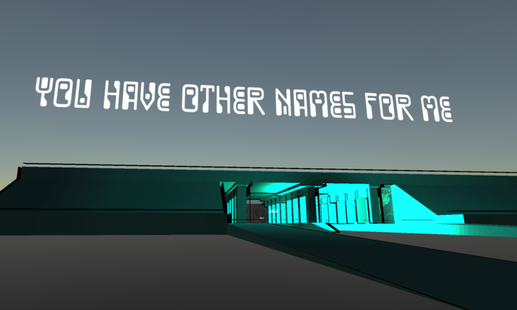

# Interactive-Narrative-
# Table of contents
[Background](#background)
[Overview](#overview)
[Main Prefabs](#prefabs)
[Models](#models2)
[Scripts](#scripts2)

[Art Installation](https://www.conncoll.edu/academics/internships-student-research/student-research-projects/immersive-virtual-environment-exploring-a-personal-campus-experience.html)

[Online Demo(Desktop Only)](https://interactivenarrative.azurewebsites.net/)

<a name = "background"/>

## Background
This was my senior capstone project. The project presentation had my application running on 4 laptops exploring the same environment together while the laptops streamed their displays on a larger screen The future of this project focuses on the power of personal narrative working along with the power of immersion. I want to develop a new way for people to tell and share stories.      

<a name = "overview"/>

# Overview

## Technical:
Up to 15 users can explore this environment  I created. You walk around with the standard "wasd" and mouse controls. Walk around the environment or go in a train to enter a new location faster. Along the way you will find boxes with floating text, simply walk into the box and the text will start cycling through parts of a poem. Each time you interact with a word cloud in the sky will also be changing. Future iterations will allow for you to submit your own messages to the word cloud for others to see. 

